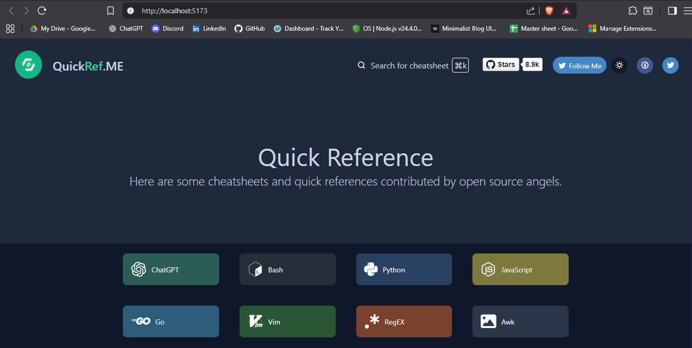
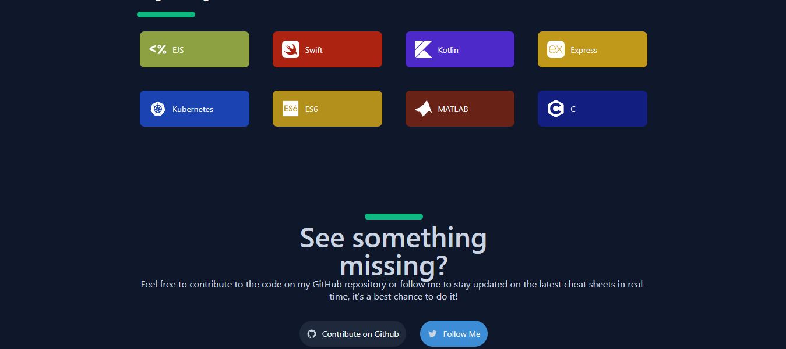

# quickref.me UI Clone

A web-based UI clone of [quickref.me](https://quickref.me), designed to provide concise and easy-to-navigate programming reference sheets. This project is built for learning and practicing modern web development skills.

## Screenshots

### Home Page



### Reference Sheet Example



## Getting Started

1. Clone the repository:
   ```bash
   git clone https://github.com/ig-imanish/QuickRef-React-clone.git
   ```
2. Install dependencies:
   ```bash
   npm install
   ```
3. Start the development server:
   ```bash
   npm start
   ```

## Technologies Used

- React
- CSS/Styled Components
- Node.js

## Tools Used

- remixicon
- font-awesome
- Svg

## License

This project is for educational purposes only.
